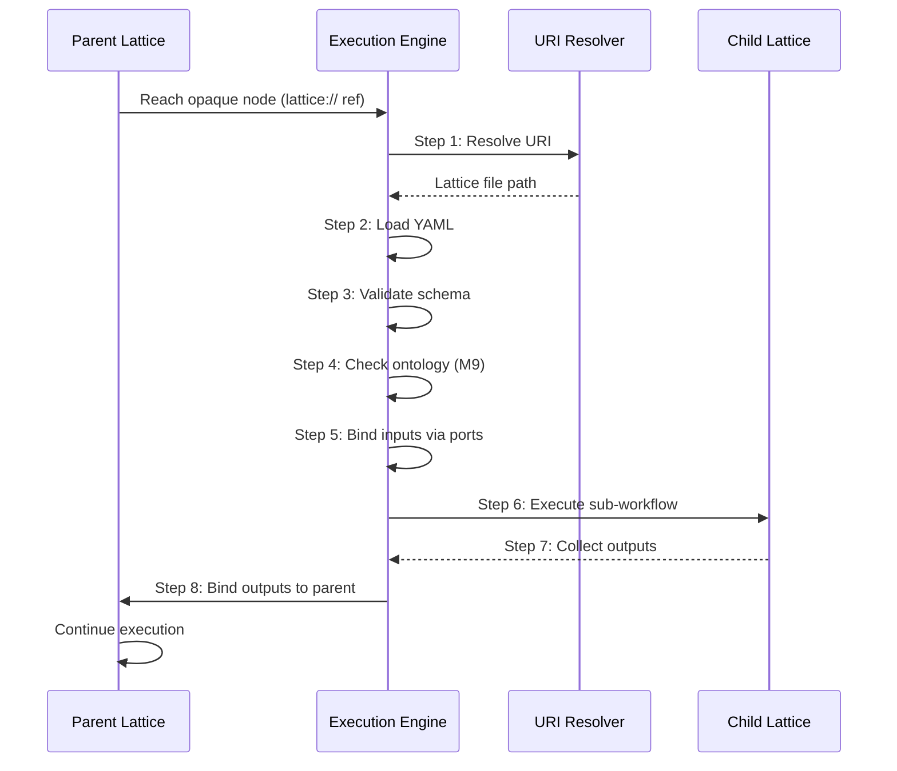
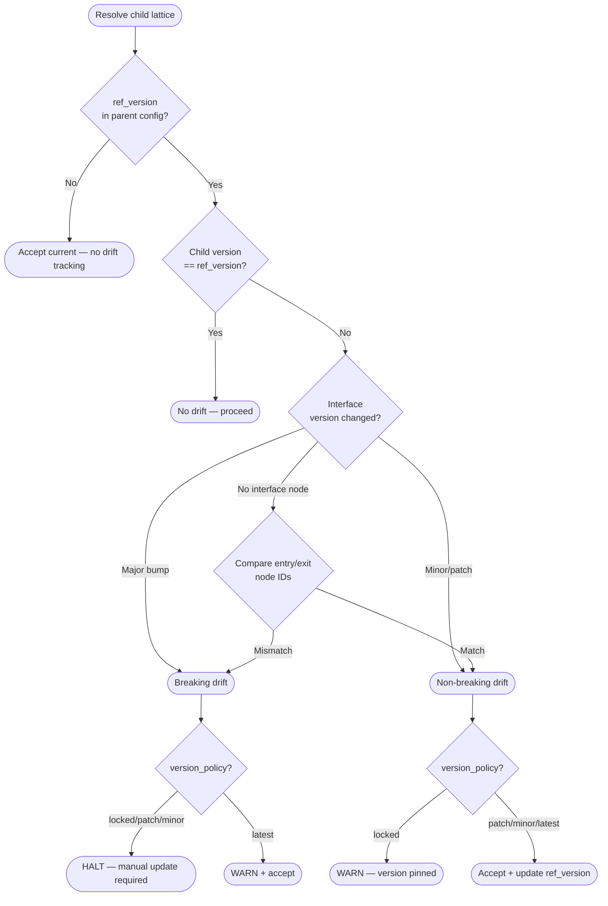

# Lattice Interop Standard

## 1. Overview

### 1.1 Purpose

This document defines the interoperability conventions for lattices that compose across aDNA instance boundaries. It addresses three concerns that the [Federation & Sharing Protocol](lattice_federation.md) scoped out: **design-time interface contracts** (how a parent discovers what a child lattice exposes), **runtime data flow** (how an execution engine dispatches work through `lattice://` references), and **version drift detection** (what happens when a referenced child lattice changes after composition).

### 1.2 Scope

| In Scope | Out of Scope |
|----------|-------------|
| Interface descriptor convention (design-time) | URI scheme definition (see [M10 §3](lattice_federation.md#3-uri-scheme)) |
| Runtime execution sequence for external references | Composition patterns (see [M10 §6](lattice_federation.md#6-composition-model)) |
| Version drift detection and resolution | Import algorithm (see [M10 §7](lattice_federation.md#7-import-algorithm)) |
| Worked interop scenario | Tooling implementation |

### 1.3 Prerequisites

| Dependency | Document | Relevance |
|-----------|----------|-----------|
| Federation & Sharing Protocol | [`lattice_federation.md`](lattice_federation.md) | URI scheme (§3), composition model (§6), import algorithm (§7) |
| Ontology Unification Protocol | [`ontology_unification.md`](ontology_unification.md) | Runtime import triggers M9 merge check |
| Lattice YAML Schema | [`lattice_yaml_schema.json`](../lattices/lattice_yaml_schema.json) | Node `config` allows additional properties; `type: process` is valid enum |
| Bridge Patterns | [`adna_bridge_patterns.md`](adna_bridge_patterns.md) | Instance discovery context |

### 1.4 Design Principles

1. **Schema-safe** — All conventions live inside node `config` objects (`additionalProperties: true`). No schema changes required.
2. **Convention over configuration** — Interface descriptors are optional metadata. A lattice without them still composes — the parent just lacks design-time introspection.
3. **Reference, don't repeat** — URI scheme, composition patterns, and import algorithm are defined in M10. This document extends but does not duplicate them.
4. **Graceful degradation** — Missing interface data or version metadata causes warnings, not failures. The system operates at reduced confidence rather than halting.

---

## 2. Lattice Interface Descriptor (Design-Time)

### 2.1 Problem

When a parent lattice references a child via `lattice://`, the parent author needs to know what the child accepts and produces — without importing or parsing the child's full node graph. M10 defines how composition works once the decision is made; this section defines how the decision is informed.

### 2.2 Interface Node Convention

A lattice MAY declare its external interface by including a dedicated node with `id: lattice_interface` and `type: process`. The interface metadata lives in the node's `config` object.

```yaml
nodes:
  # ... operational nodes ...
  - id: lattice_interface
    type: process
    description: "Interface descriptor — not an execution node"
    config:
      interface_version: "1.0.0"
      entry_nodes:
        - id: structure_prediction
          accepts:
            sequences: "list[str] — amino acid sequences"
            target_pdb: "str — path to target PDB file"
        - id: interface_analysis
          accepts:
            complex_structures: "list[str] — predicted complex PDB paths"
      exit_nodes:
        - id: ranking
          produces:
            ranked_candidates: "list[dict] — candidates sorted by composite score"
            binding_scores: "list[float] — per-candidate binding scores"
      ports:
        inputs:
          - name: input_sequences
            maps_to: structure_prediction
            description: "Designed binder sequences for validation"
          - name: input_complexes
            maps_to: interface_analysis
            description: "Pre-computed complex structures (bypass prediction)"
        outputs:
          - name: candidate_scores
            maps_from: ranking
            description: "Ranked binding assessment results"
```

### 2.3 Convention Rules

| Property | Required | Description |
|----------|----------|-------------|
| `interface_version` | Yes | Semver of the interface contract itself |
| `entry_nodes` | Yes | Nodes that accept external input, with typed `accepts` map |
| `exit_nodes` | Yes | Nodes that produce external output, with typed `produces` map |
| `ports` | Recommended | Named input/output ports for seam edge binding |

**Schema validity**: `lattice_interface` is a valid node — `id` matches `^[a-z][a-z0-9_]*$`, `type: process` is in the enum, and `config` allows arbitrary keys. The node has no edges connecting it to operational nodes — it is a metadata-only declaration.

### 2.4 Interface Discovery Protocol

When a parent author considers referencing a child lattice:

```
1. RESOLVE the child lattice URI per M10 §3.2
2. PARSE the child lattice YAML
3. SEARCH nodes for id == "lattice_interface"
4. IF found:
     READ config.ports — these are the named connection points
     READ config.entry_nodes / config.exit_nodes — typed I/O contracts
     USE ports to construct seam edges with data_mapping (M10 §6.5)
5. IF not found:
     WARN "No interface descriptor — inspect node graph manually"
     FALLBACK to reading node descriptions and edge data_mapping
```

### 2.5 Seam Edge Port Binding

Interface ports connect to M10 seam edges via `data_mapping` and `port`:

```yaml
# Parent seam edge — external reference pattern (M10 §6.5)
edges:
  - from: candidate_generation
    to: docking_assessment                    # opaque child node
    label: "binder candidates"
    data_mapping:
      designed_sequences: input_sequences     # maps to child port name
    port: structure_prediction                # target entry node
  - from: docking_assessment
    to: clinical_ranking
    label: "validation results"
    data_mapping:
      candidate_scores: binding_scores        # maps from child port name
```

The `port` field on an edge (already in the schema) identifies which child entry node receives the data. The `data_mapping` keys correspond to the interface port names declared in `config.ports`.

---

## 3. Runtime Data Flow Specification

### 3.1 Inline vs External at Runtime

| Pattern | Runtime Behavior |
|---------|-----------------|
| **Inline** (M10 §6.1) | Child nodes are already materialized in the parent with namespace prefixes. The runtime treats them as native nodes — no special handling needed. |
| **External reference** (M10 §6.2) | Child appears as an opaque node with a `lattice://` URI. The runtime must resolve, load, and dispatch to the child lattice. This section specifies that process. |

### 3.2 External Reference Execution Sequence

When the execution engine reaches a node whose `ref` is a `lattice://` URI:

```
Step 1: RESOLVE — Resolve the lattice:// URI per M10 §3.2
        (instance resolution → lattice resolution)
Step 2: LOAD — Parse the resolved .lattice.yaml file
Step 3: VALIDATE — Run schema validation on the loaded lattice
Step 4: CHECK ONTOLOGY — If the child introduces new entity types,
        trigger M9 compatibility check (§3.2-3.3)
Step 5: BIND INPUTS — Map parent seam edge data_mapping to child
        entry node inputs using interface ports (§2.5)
Step 6: EXECUTE — Run the child lattice as a sub-workflow
        in an isolated execution context
Step 7: COLLECT OUTPUTS — Gather results from child exit nodes
        per interface port declarations
Step 8: BIND OUTPUTS — Map child outputs back to parent via
        outbound seam edge data_mapping
```

### 3.3 Execution Isolation Rules

| Rule | Specification |
|------|--------------|
| **Namespace isolation** | Child node IDs are NOT visible to parent. The child executes in its own namespace. |
| **Config isolation** | Child node configs are independent. Parent cannot override child node parameters. |
| **Execution context** | Child runs as a sub-workflow. If child specifies `execution.runtime: ray`, the engine provisions accordingly. |
| **Error containment** | Errors within child execution do not crash the parent. The parent receives a structured error result from the opaque node. |
| **Timeout** | Parent MAY specify a timeout on the seam edge (via `config.timeout_seconds` on the opaque node). Default: runtime-defined. |

### 3.4 Error Handling

| Condition | Severity | Behavior |
|-----------|----------|----------|
| URI unresolvable | ERROR | Halt execution of this branch. Parent receives `{error: "uri_unresolvable", uri: "..."}`. |
| Schema validation fails | ERROR | Halt. Child lattice is malformed. Parent receives `{error: "schema_invalid", details: [...]}`. |
| Child execution fails | ERROR | Halt this branch. Parent receives `{error: "execution_failed", child: "...", cause: "..."}`. |
| Port mismatch | WARNING | Input data key has no matching child entry port. Log warning, pass data as-is to first entry node. |
| Timeout exceeded | ERROR | Terminate child execution. Parent receives `{error: "timeout", child: "...", elapsed_seconds: N}`. |

### 3.5 Sequence Diagram



---

## 4. Version Drift Detection and Resolution

### 4.1 Problem

When a parent lattice references a child via `lattice://`, the child may change after composition — nodes added, removed, or renamed; interface ports altered; internal logic modified. The parent needs to detect and respond to these changes.

### 4.2 Reference Version Convention

A parent lattice's opaque node MAY record the child version it was composed against:

```yaml
nodes:
  - id: docking_assessment
    type: module
    ref: "lattice://adna/docking_assessment"
    description: "Validate candidates via docking assessment"
    config:
      ref_version: "1.0.0"          # child version at composition time
      ref_interface_version: "1.0.0"  # child interface contract version
```

Both fields live in the opaque node's `config` object (schema-safe). They are optional — omitting them means the parent accepts whatever version is current (`latest` behavior).

### 4.3 Severity Classification

| Change Type | Breaking? | Detection |
|-------------|-----------|-----------|
| Node added (not entry/exit) | No | Child `version` minor/patch bump |
| Node config changed | No | Child `version` patch bump |
| Edge added/reordered internally | No | Child `version` minor bump |
| Entry/exit node removed | **Yes** | Interface `entry_nodes`/`exit_nodes` list changed |
| Port renamed | **Yes** | Interface `ports` names changed |
| Port type changed | **Yes** | Interface port `accepts`/`produces` schema changed |
| `interface_version` major bump | **Yes** | `config.interface_version` major differs from `ref_interface_version` |

**Rule**: A change is **breaking** if it alters the interface contract — entry/exit nodes, port names, or port types. All other changes are non-breaking.

### 4.4 Resolution Strategies by Version Policy

The parent's `federation.version_policy` (M10 §2.1) governs how drift is handled:

| `version_policy` | On Non-Breaking Drift | On Breaking Drift |
|-------------------|----------------------|-------------------|
| `locked` | WARN — child changed from pinned version | ERROR — halt, require manual update |
| `patch` | ACCEPT — auto-update if child patch changed | ERROR — halt, require manual update |
| `minor` | ACCEPT — auto-update if child minor/patch changed | ERROR — halt, require manual update |
| `latest` | ACCEPT — always use current child | WARN + ACCEPT — use current, log compatibility risk |

### 4.5 Drift Recovery Workflow

When a breaking change is detected:

```
Step 1: DETECT — Compare ref_version / ref_interface_version
        against resolved child's current values
Step 2: CLASSIFY — Breaking or non-breaking per §4.3 table
Step 3: EVALUATE POLICY — Check version_policy per §4.4
Step 4: IF policy allows:
          ACCEPT — Update ref_version in parent config
          LOG drift report
        IF policy blocks:
          HALT — Do not execute child
          GENERATE drift report
Step 5: REPORT — Produce structured drift report (§4.6)
Step 6: REMEDIATE (if halted) — Author updates parent seam edges,
        data_mapping, and port references to match new interface
```

### 4.6 Drift Report Format

```yaml
drift_report:
  parent_lattice: composed_therapeutics
  child_lattice: docking_assessment
  child_uri: "lattice://adna/docking_assessment"
  detection_time: "2026-02-20T14:30:00Z"
  ref_version: "1.0.0"
  current_version: "2.0.0"
  ref_interface_version: "1.0.0"
  current_interface_version: "2.0.0"
  severity: breaking
  changes:
    - type: port_renamed
      old: input_sequences
      new: binder_sequences
    - type: exit_node_removed
      node: ranking
      replacement: composite_ranking
  policy: locked
  action: halt
  remediation: "Update parent seam edges: data_mapping key 'designed_sequences: input_sequences' → 'designed_sequences: binder_sequences'. Replace exit port 'candidate_scores' mapping from 'ranking' → 'composite_ranking'."
```

### 4.7 Drift Detection Flowchart



---

## 5. Worked Example

This example traces all three concerns through the existing `docking_assessment` and `composed_therapeutics` lattices.

### 5.1 Interface Declaration on docking_assessment

Add the interface node to `docking_assessment.lattice.yaml`:

```yaml
nodes:
  # ... existing 3 operational nodes ...
  - id: lattice_interface
    type: process
    description: "Interface descriptor — not an execution node"
    config:
      interface_version: "1.0.0"
      entry_nodes:
        - id: structure_prediction
          accepts:
            sequences: "list[str]"
            target_pdb: "str"
      exit_nodes:
        - id: ranking
          produces:
            ranked_candidates: "list[dict]"
            binding_scores: "list[float]"
      ports:
        inputs:
          - name: input_sequences
            maps_to: structure_prediction
            description: "Binder sequences for validation"
        outputs:
          - name: candidate_scores
            maps_from: ranking
            description: "Ranked binding assessment results"
```

### 5.2 Seam Edge Binding in composed_therapeutics

The parent's seam edges reference the child's interface ports:

```yaml
# Existing in composed_therapeutics.lattice.yaml
edges:
  - from: candidate_generation
    to: docking_assessment
    label: "binder candidates"
    data_mapping:
      designed_sequences: input_sequences     # child input port
  - from: docking_assessment
    to: clinical_ranking
    label: "validation results"
    data_mapping:
      candidate_scores: binding_scores        # child output port
```

The parent also records the version it was composed against:

```yaml
nodes:
  - id: docking_assessment
    type: module
    ref: "lattice://adna/docking_assessment"
    config:
      ref_version: "1.0.0"
      ref_interface_version: "1.0.0"
```

### 5.3 Runtime Walk-Through

When `composed_therapeutics` executes and reaches the `docking_assessment` node:

| Step | Action | Result |
|------|--------|--------|
| 1. RESOLVE | Resolve `lattice://adna/docking_assessment` | Locate `docking_assessment.lattice.yaml` |
| 2. LOAD | Parse the child YAML | 3 operational nodes + 1 interface node |
| 3. VALIDATE | Schema check | PASS |
| 4. CHECK ONTOLOGY | Child uses `module` + `process` types (base) | No merge needed — base types only |
| 5. BIND INPUTS | Map `designed_sequences → input_sequences → structure_prediction` | Sequences delivered to entry node |
| 6. EXECUTE | Run structure_prediction → interface_analysis → ranking | Sub-workflow completes |
| 7. COLLECT | Gather `ranking` output: `{ranked_candidates: [...], binding_scores: [...]}` | Results ready |
| 8. BIND OUTPUTS | Map `candidate_scores → binding_scores → clinical_ranking` | Parent continues to clinical_ranking |

### 5.4 Drift Scenarios

**Scenario A: Non-breaking change.** The `docking_assessment` author adds a `filtering` node between `interface_analysis` and `ranking`, bumping version to `1.1.0`. Interface version remains `1.0.0` — ports unchanged.

- Parent has `ref_version: "1.0.0"`, child is now `1.1.0`
- Interface version match → non-breaking
- Parent's `version_policy: minor` → ACCEPT, update `ref_version` to `1.1.0`
- No author intervention needed

**Scenario B: Breaking change.** The `docking_assessment` author renames port `input_sequences` to `binder_sequences` and bumps interface version to `2.0.0`.

- Parent has `ref_interface_version: "1.0.0"`, child is now `2.0.0`
- Interface major version mismatch → breaking
- Parent's `version_policy: minor` → HALT
- Drift report generated (§4.6)
- Author updates parent seam edge: `designed_sequences: input_sequences` → `designed_sequences: binder_sequences`
- Author updates `ref_version` and `ref_interface_version` to `2.0.0`
- Execution resumes

---

## Appendix A: Document Relationship Table

| Document | Scope | Relationship to M11 |
|----------|-------|---------------------|
| [Ontology Unification Protocol](ontology_unification.md) (M9) | Ontology merge algorithm | Runtime step 4 triggers M9 check when child introduces new entity types |
| [Federation & Sharing Protocol](lattice_federation.md) (M10) | Federation lifecycle, URI scheme, composition | M11 extends M10's composition model with interface contracts, runtime sequence, and version drift |
| **Lattice Interop Standard** (M11, this doc) | Interface contracts, runtime flow, version drift | Fills three gaps M10 scoped out |

**Division of responsibility**:
- **M10** answers: *What is the URI? How do you compose?* (protocol mechanics)
- **M11** answers: *What does the child expose? How does data flow at runtime? What if the child changes?* (interop conventions)

## Appendix B: Cross-References

| Document | Relationship |
|----------|-------------|
| [`lattice_federation.md`](lattice_federation.md) | URI scheme (§3), composition model (§6), seam edges (§6.5), import algorithm (§7) |
| [`ontology_unification.md`](ontology_unification.md) | Merge algorithm triggered at runtime step 4 |
| [`adna_bridge_patterns.md`](adna_bridge_patterns.md) | Instance discovery, scope boundaries |
| [`adna_standard.md`](adna_standard.md) | Normative aDNA specification |
| [`lattice_yaml_schema.json`](../lattices/lattice_yaml_schema.json) | Schema — node `config.additionalProperties: true` enables interface convention |
| [`context_quality_rubric.md`](context_quality_rubric.md) | Quality evaluation applicable to interop documentation |
| [`docking_assessment.lattice.yaml`](../lattices/examples/docking_assessment.lattice.yaml) | Worked example — child lattice |
| [`composed_therapeutics.lattice.yaml`](../lattices/examples/composed_therapeutics.lattice.yaml) | Worked example — parent lattice |

---

*Protocol version: 1.0.0*
*Author: agent_stanley (Berthier)*
*Campaign: campaign_adna_review, Mission M11*
